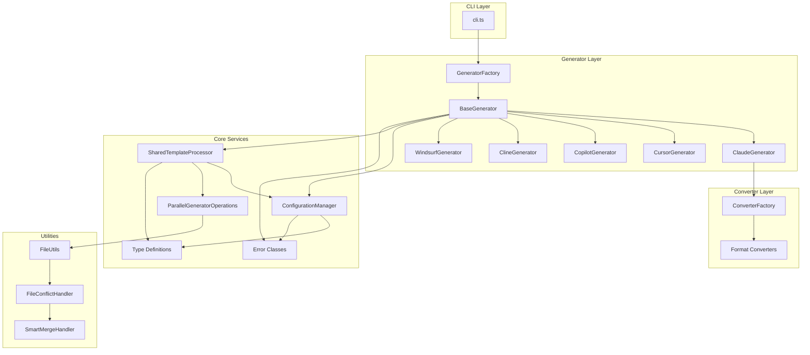
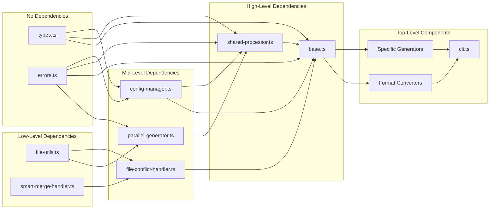

# ai-instructions

🤖 **Professional CLI tool to scaffold AI development instructions for ClaudeCode, Cursor, GitHub Copilot and more**

**English** | [日本語](./README.ja.md)

[](https://www.npmjs.com/package/@arkatom/ai-instructions)
[](./test)
[](https://www.typescriptlang.org/)
[](./LICENSE)
[](https://semver.org/)

## 📋 Overview

`ai-instructions` streamlines the setup of AI-driven development environments by generating comprehensive instruction templates and configuration files. Perfect for teams and individual developers who want to standardize their AI assistant interactions across projects.

### ✨ Key Benefits

- **🚀 Instant Setup**: Generate instruction templates in seconds
- **🛠️ Multi-Tool Support**: Claude Code, GitHub Copilot, Cursor AI IDE, and Cline AI support
- **📚 Development Templates**: Essential development methodology guides (TDD, Git workflow, Scrum)
- **🌐 Multilingual Core**: Main instructions available in English, Japanese, and Chinese
- **🛡️ Advanced File Safety**: 5 intelligent conflict resolution strategies with smart merging
- **⚙️ Highly Configurable**: Customizable project names and output directories
- **🔒 Validated Input**: Built-in validation for project names and paths
- **🧪 Battle-tested**: Comprehensive test suite ensuring reliability
- **🎯 Agent Templates**: 70+ specialized agent templates (CLI integration pending - see Issue #93)

## 🛡️ Advanced File Safety System (v0.5.0)

**🚀 NEW: Intelligent conflict resolution with 5 resolution strategies**

### 🔒 Safe Usage Patterns

```bash
# ✅ RECOMMENDED: Interactive conflict resolution (default)
ai-instructions init --project-name "My Project"

# ✅ SAFE: Automatic backup creation
ai-instructions init --conflict-resolution backup --project-name "My Project"

# ✅ SMART: Merge existing + template content intelligently
ai-instructions init --conflict-resolution merge --project-name "My Project"

# ✅ PREVIEW: See what files would be created/modified
ai-instructions init --preview

# ⚠️ SKIP: Skip conflicting files (non-destructive)
ai-instructions init --conflict-resolution skip --project-name "My Project"

# 🚨 DANGEROUS: Force overwrite (use with extreme caution)
ai-instructions init --force --conflict-resolution overwrite
```

### 🛡️ Conflict Resolution Strategies

When existing files are detected, you can choose from 5 intelligent strategies:

| Strategy | Behavior | Use Case | Data Safety |
|----------|----------|----------|-------------|
| `backup` | Creates timestamped backup, writes new file | **Default** - Safest option | 🟢 High |
| `merge` | Intelligently merges existing + template content | Update existing instructions | 🟢 High |
| `interactive` | Prompts for choice per conflict | Full control over each file | 🟢 High |
| `skip` | Skips conflicting files, creates non-conflicting ones | Partial update scenarios | 🟢 High |
| `overwrite` | Overwrites without backup | **Dangerous** - Only with --force | 🔴 None |

### 🔧 Advanced CLI Options (v0.5.0)

```bash
# Conflict resolution strategy
ai-instructions init --conflict-resolution <backup|merge|interactive|skip|overwrite>

# Disable interactive prompts (batch mode)
ai-instructions init --no-interactive

# Disable automatic backups (use with caution)
ai-instructions init --no-backup

# Preview mode - see what would happen
ai-instructions init --preview
```

### 🧠 Intelligent Content Merging

For markdown files, the merge strategy uses smart content analysis:
- **Headers**: Preserves unique sections from both files
- **Content blocks**: Avoids duplication
- **Metadata**: Maintains existing project-specific content
- **Templates**: Integrates new template content seamlessly

### 📁 Backup System

When using `backup` or `merge` strategies:
- Creates timestamped backups: `filename.backup.YYYYMMDD_HHMMSS.ext`
- Handles multiple backups automatically
- Never overwrites existing backups

> **💡 Pro Tip**: Use `--conflict-resolution merge` to update existing instruction files while preserving your customizations!

## 🏗️ Architecture & Dependency Management

### System Architecture



### Dependency Flow



### Module Responsibilities

| Module | Purpose | Dependencies | Dependents |
|--------|---------|--------------|------------|
| **types.ts** | Type definitions & guards | None | All modules |
| **errors.ts** | Error class hierarchy | None | Core services |
| **config-manager.ts** | Configuration loading & caching | types, errors | Generators, SharedProc |
| **parallel-generator.ts** | Parallel file operations | errors, FileUtils | SharedProc |
| **shared-processor.ts** | Template processing logic | types, config, parallel | Generators |
| **base.ts** | Abstract generator base | All core services | Specific generators |
| **file-utils.ts** | File operations | None | Multiple modules |
| **file-conflict-handler.ts** | Conflict resolution | FileUtils, MergeHandler | Base generator |

### Circular Dependency Prevention

This project uses **ESLint with eslint-plugin-import** to automatically detect and prevent circular dependencies:

```javascript
// eslint.config.js
'import/no-cycle': ['error', {
  maxDepth: Infinity,
  ignoreExternal: true
}]
```

**Benefits:**
- ✅ Build-time detection of circular imports
- ✅ Prevents runtime errors from dependency cycles
- ✅ Enforces clean architecture principles
- ✅ Integrated into CI/CD pipeline

### Directory Structure

```
src/
├── generators/           # Generator implementations
│   ├── base.ts          # Abstract base class
│   ├── claude.ts        # Claude-specific generator
│   ├── cursor.ts        # Cursor-specific generator
│   ├── cline.ts         # Cline-specific generator
│   ├── copilot.ts       # GitHub Copilot generator
│   ├── windsurf.ts      # Windsurf generator
│   ├── factory.ts       # Generator factory
│   ├── config-manager.ts    # Configuration management
│   ├── errors.ts        # Error definitions
│   ├── parallel-generator.ts # Parallel operations
│   ├── shared-processor.ts   # Shared processing
│   └── types.ts         # Type definitions
├── converters/          # Format converters
│   ├── index.ts         # Converter exports
│   ├── format-converter.ts   # Base converter
│   ├── cursor-converter.ts   # Cursor format
│   ├── copilot-converter.ts  # Copilot format
│   └── windsurf-converter.ts # Windsurf format
├── utils/               # Utility functions
│   ├── file-utils.ts    # File operations
│   ├── file-conflict-handler.ts # Conflict resolution
│   └── smart-merge-handler.ts   # Content merging
└── cli.ts               # CLI entry point
```

## 📦 Installation

### Global Installation (Recommended)

```bash
npm install -g @arkatom/ai-instructions
```

### Local Project Installation

```bash
npm install --save-dev @arkatom/ai-instructions
```

### Usage without Installation

```bash
npx @arkatom/ai-instructions init
```

## 🚀 Quick Start

### Basic Usage

```bash
ai-instructions init
```

This creates a complete set of AI development instructions in your current directory.

### Check Current Status

```bash
# Check AI instruction files in current directory
ai-instructions status

# Check specific directory
ai-instructions status --directory ./my-project
```

### Interactive Help Guide

```bash
# Launch interactive setup guide with examples
ai-instructions help-interactive
```

### Custom Project Setup

```bash
ai-instructions init --project-name "my-awesome-project" --output ./my-project
```

### Multi-Tool Support

Generate instructions for different AI development tools:

```bash
# Generate Claude Code instructions (default)
ai-instructions init --tool claude

# Generate GitHub Copilot instructions
ai-instructions init --tool github-copilot --project-name "my-project"

# Generate Cursor AI IDE instructions
ai-instructions init --tool cursor --project-name "my-project"

# Generate Cline AI instructions
ai-instructions init --tool cline --project-name "my-project"
```

### Format Conversion (New in v0.3.0)

Generate Claude templates and convert to other formats:

```bash
# Convert to Cursor MDC format with short option
ai-instructions init -f cursor --project-name "my-project"

# Convert to GitHub Copilot 2024 standard
ai-instructions init --output-format copilot --project-name "my-project"

# Convert to Windsurf pair programming rules
ai-instructions init --output-format windsurf --project-name "my-project"

# Maintain original Claude format (default)
ai-instructions init --output-format claude --project-name "my-project"
```

### Language Options

The main instruction file is available in multiple languages:

```bash
# English (default)
ai-instructions init --lang en --project-name "my-project"

# Japanese (main instruction file)
ai-instructions init --lang ja --project-name "プロジェクト名"

# Chinese (main instruction file)
ai-instructions init --lang ch --project-name "项目名称"

# Combined: Japanese main file with Cursor format
ai-instructions init -f cursor --lang ja --project-name "カーソルプロジェクト"
```

**Note**: Currently, only the main instruction file (`CLAUDE.md`/core) supports multiple languages. Other templates are in English.

### Safe Updates and Migrations (v0.5.0)

```bash
# Update existing project instructions with intelligent merging
ai-instructions init --conflict-resolution merge --project-name "existing-project"

# Backup existing files before updating
ai-instructions init --conflict-resolution backup --project-name "existing-project"

# Interactive updates - choose per file
ai-instructions init --conflict-resolution interactive --project-name "existing-project"

# Non-destructive partial update
ai-instructions init --conflict-resolution skip --project-name "existing-project"

# Batch mode without prompts (CI/CD safe)
ai-instructions init --no-interactive --conflict-resolution backup
```

### Real-world Examples

```bash
# Setup for a React project
ai-instructions init --project-name "react-dashboard" --output ./projects/dashboard

# Setup for a Japanese project
ai-instructions init --project-name "プロジェクト名" --output ./日本語プロジェクト

# Setup with spaces in name
ai-instructions init --project-name "My Enterprise App" --output ./enterprise
```

## 📁 Generated File Structure

The file structure varies depending on the AI tool you select:

### Claude Code (Default)
```
your-project/
├── CLAUDE.md                    # Main ClaudeCode instructions
└── instructions/                # Development methodology guides
    ├── base.md                  # Core development rules (MUST READ)
    ├── deep-think.md           # Deep thinking methodology
    ├── KentBeck-tdd-rules.md   # Test-Driven Development rules
    ├── commit-rules.md         # Git commit conventions
    ├── pr-rules.md             # Pull request guidelines
    ├── git.md                  # Git workflow instructions
    ├── develop.md              # Development process guide
    ├── command.md              # Shell command execution rules
    └── memo/
        └── index.md            # Project memo template
```

### GitHub Copilot (`--tool github-copilot` or `--output-format copilot`)
```
your-project/
└── .github/
    └── copilot-instructions.md  # GitHub Copilot 2024 standard format
```

### Cursor AI IDE (`--tool cursor` or `--output-format cursor`)
```
your-project/
└── .cursor/
    └── rules/
        └── main.mdc            # Cursor AI rules with YAML front matter
```

### Windsurf AI (`--output-format windsurf`)
```
your-project/
└── .windsurfrules              # Windsurf pair programming rules
```

### Cline AI (`--tool cline`)
```
your-project/
├── .clinerules/                # Cline AI rule directory
│   ├── 01-coding.md           # Core development rules
│   └── 02-documentation.md    # Documentation standards
└── instructions/              # Comprehensive development guides
    ├── base.md                # Core development rules (MUST READ)
    ├── deep-think.md         # Deep thinking methodology
    ├── note.md               # Work documentation guidelines
    └── ... (additional methodology and workflow files)
```

### File Descriptions

| File | Purpose | Key Content |
|------|---------|-------------|
| `CLAUDE.md` | Main entry point for AI assistants | Project-specific instructions with {{projectName}} replaced |
| `base.md` | Core development principles | Fundamental rules that must be followed |
| `deep-think.md` | Thinking methodology | Quality-first approach and analytical thinking |
| `KentBeck-tdd-rules.md` | TDD methodology | Kent Beck's Test-Driven Development principles |
| `commit-rules.md` | Git commit standards | Semantic commit message format with domain tags |
| `pr-rules.md` | Pull request rules | PR creation guidelines and review process |

## ⚙️ Configuration Options

### Available Commands

| Command | Description | Example |
|---------|-------------|---------|
| `init` | Initialize AI development instructions | `ai-instructions init` |
| `status` | Show current configuration status | `ai-instructions status` |
| `help-interactive` | Launch interactive help guide | `ai-instructions help-interactive` |
| `help` | Display help for a command | `ai-instructions help init` |

### Command Line Options

| Option | Alias | Description | Default | Example |
|--------|-------|-------------|---------|---------|
| `--lang` | `-l` | Template language (en, ja, ch) | `en` | `--lang ja` |
| `--output-format` | `-f` | Output format (claude, cursor, copilot, windsurf) | `claude` | `-f cursor` |
| `--output` | `-o` | Output directory | Current directory | `--output ./my-project` |
| `--project-name` | `-n` | Project name for templates | `my-project` | `--project-name "My App"` |
| `--tool` | `-t` | AI tool type (legacy, use --output-format) | `claude` | `--tool cursor` |
| `--conflict-resolution` | | 🛡️ Conflict resolution strategy (backup, merge, interactive, skip, overwrite) | `backup` | `--conflict-resolution merge` |
| `--no-interactive` | | 🤖 Disable interactive conflict resolution | `false` | `--no-interactive` |
| `--no-backup` | | 🚨 Disable automatic backups (use with caution) | `false` | `--no-backup` |
| `--force` | | ⚠️ Force overwrite existing files (DANGEROUS) | `false` | `--force` |
| `--preview` | | 🔍 Preview files that would be created/modified | `false` | `--preview` |
| `--version` | | Show version number | | |
| `--help` | | Display help information | | |

### Project Name Validation

The CLI validates project names to ensure filesystem compatibility:

- ✅ **Allowed**: Letters, numbers, spaces, hyphens, underscores, Unicode characters
- ❌ **Forbidden**: `<`, `>`, `|` characters
- ❌ **Invalid**: Empty strings or whitespace-only names

### Examples of Valid Project Names

```bash
ai-instructions init --project-name "My Project"           # ✅ Spaces
ai-instructions init --project-name "my-awesome_project-v2" # ✅ Hyphens & underscores
ai-instructions init --project-name "プロジェクト名"          # ✅ Unicode/Japanese
ai-instructions init --project-name "Project123"           # ✅ Numbers
```

### Output Format Validation

The CLI validates output formats to ensure compatibility:

- ✅ **Supported Formats**: `claude`, `cursor`, `copilot`, `windsurf`
- ✅ **Case Sensitive**: Format names must be lowercase
- ❌ **Invalid**: `CLAUDE`, `Cursor`, `GitHub-Copilot`

### Language Code Validation

- ✅ **Supported Languages**: `en` (English), `ja` (Japanese), `ch` (Chinese)
- ✅ **Case Sensitive**: Language codes must be lowercase
- ❌ **Invalid**: `EN`, `JA`, `fr`, `es`

## 🔄 Format Conversion Benefits

### Why Use Format Conversion?

1. **🎆 Single Source of Truth**: Maintain comprehensive Claude templates
2. **🔧 Tool-Specific Optimization**: Each format optimized for its AI tool
3. **🗏 Multi-Tool Workflows**: Switch between AI tools seamlessly
4. **🌐 Consistent Standards**: Apply same development practices across tools

### Format-Specific Features

| Format | File Extension | Key Features |
|--------|----------------|---------------|
| `claude` | `.md` | Full instruction hierarchy, TDD rules, comprehensive guides |
| `cursor` | `.mdc` | YAML front matter, MDC format, Cursor-optimized prompts |
| `copilot` | `.md` | GitHub 2024 standard, repository-focused instructions |
| `windsurf` | `.windsurfrules` | Pair programming focus, collaborative development rules |
| `cline` | `.md` | Multiple specialized files in .clinerules directory |

## 🛠️ Development

### Prerequisites

- Node.js 16+
- npm 7+
- TypeScript 5.0+

### Setup Development Environment

```bash
# Clone the repository
git clone https://github.com/arkatom/ai-instructions.git
cd ai-instructions

# Install dependencies
npm install

# Run tests
npm test

# Build the project
npm run build

# Test CLI locally
npm run cli init --help
```

### Running Tests

```bash
# Run all tests (8 test suites, 110 tests)
npm test

# Run tests in watch mode
npm run test:watch

# Run tests with coverage
npm run test:coverage
```

### Test Coverage

Our comprehensive test suite includes:

- **Basic CLI functionality** (version, help, commands) - 41 tests
- **Format conversion system** (Claude → Cursor/Copilot/Windsurf) - 16 tests
- **Multi-language support** (English, Japanese, Chinese templates) - 21 tests
- **Multi-tool generators** (Claude, GitHub Copilot, Cursor) - 17 tests
- **Error handling** (invalid inputs, filesystem errors, validation) - 8 tests
- **Edge cases** (Unicode names, very long names, empty strings) - 7 tests

**Key Test Categories:**
- **CLI Output Format Support**: 12 comprehensive tests for --output-format/-f option
- **Multi-Language Templates**: Tests for en/ja/ch language generation
- **GitHub Copilot 2024 Standard**: Tests for new .github/copilot-instructions.md path
- **Content verification**: Generated file structure and content validation
- **Integration testing**: End-to-end CLI workflows with format conversion

### Build and Distribution

```bash
# Build TypeScript to JavaScript
npm run build

# Create distribution package
npm pack

# Publish to npm (maintainers only)
npm publish
```

## 📌 Versioning

This project adheres to [Semantic Versioning](https://semver.org/spec/v2.0.0.html) (SemVer). Version numbers follow the format `MAJOR.MINOR.PATCH`:

- **MAJOR**: Incompatible API changes or breaking changes
- **MINOR**: New functionality in a backwards compatible manner
- **PATCH**: Backwards compatible bug fixes

For example:
- `0.3.0` → `0.3.1`: Bug fixes or minor improvements
- `0.3.1` → `0.4.0`: New features or enhancements
- `0.4.0` → `1.0.0`: Breaking changes or major redesign

## 🤝 Contributing

We welcome contributions! Please see our [Contributing Guidelines](./CONTRIBUTING.md) for details.

### Development Workflow

1. **Fork** the repository
2. **Create** a feature branch (`git checkout -b feature/amazing-feature`)
3. **Follow TDD** principles - write tests first
4. **Implement** your changes with proper TypeScript types
5. **Test** thoroughly (`npm test`)
6. **Commit** using our [commit conventions](./instructions/commit-rules.md)
7. **Submit** a pull request

### Code Quality Standards

- **TDD Required**: All new features must have tests
- **TypeScript**: Strict type checking enabled
- **ESLint**: Code style enforcement
- **100% Test Coverage**: For new features
- **Documentation**: Update README for new features

## 📝 License

This project is licensed under the MIT License - see the [LICENSE](./LICENSE) file for details.

## 📞 Support

- **Issues**: [GitHub Issues](https://github.com/arkatom/ai-instructions/issues)
- **Documentation**: This README and generated instruction files
- **Examples**: See the [examples](./examples) directory

## 🙏 Acknowledgments

- **Kent Beck** for the foundational Test-Driven Development methodology
  - *"Test-Driven Development: By Example"* (2003) - The seminal work that defined TDD
  - *"Tidy First?"* (2023) - Modern approach to structural vs behavioral changes
  - The three rules of TDD that guide our development process
- **Martin Fowler** for documenting and evangelizing TDD practices
- **ClaudeCode team** for inspiration on AI-assisted development workflows
- **Open source community** for the excellent tools and libraries that make this possible

---

**Made with ❤️ for AI-assisted development workflows**
