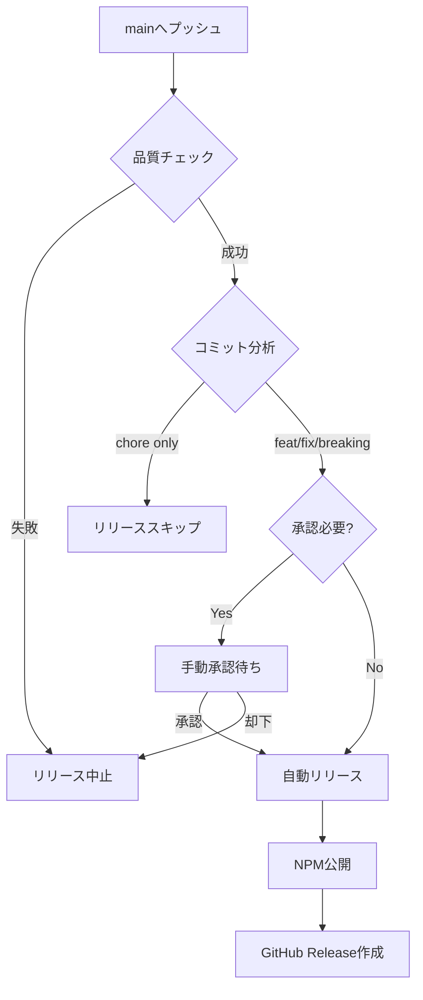

# リリース品質ゲート戦略

## 背景と問題認識

現在のCI/CDパイプラインは「速さ」を優先し、品質検証が不十分です。
これはCLAUDE.mdの「品質優先」原則に反しており、ユーザーに価値のない変更まで公開するリスクがあります。

## 品質ゲートの3段階戦略

### 🔴 Stage 1: 自動品質チェック（必須）
**目的**: 基本的な品質基準を満たさない変更を自動で排除

#### チェック項目
- **テストカバレッジ**: 70%以上（将来的に80%へ）
- **TypeScript strict mode**: エラー0
- **ESLint**: warnings 0、errors 0
- **バンドルサイズ**: 前回比110%以内
- **セキュリティ監査**: high/critical脆弱性0

#### 実装状態
✅ `release-gated.yml`で実装済み

### 🟡 Stage 2: セマンティックリリース判定
**目的**: 変更の意味を正しく評価し、適切なバージョニング

#### コミット分析
```
BREAKING CHANGE → major version (1.0.0 → 2.0.0)
feat:           → minor version (1.0.0 → 1.1.0)
fix:            → patch version (1.0.0 → 1.0.1)
chore:/docs:    → no release
```

#### 実装状態
✅ `release-gated.yml`で実装済み

### 🟢 Stage 3: 手動承認ゲート
**目的**: 重要な変更には人間の判断を介入

#### 承認が必要なケース
- Major version bump
- 初回リリース
- セキュリティ関連の修正
- Breaking changes

#### 実装状態
✅ GitHub Environmentsの`production`環境で実装

## リリースフロー



## 緊急時の対応

### ホットフィックス
```bash
# 緊急修正用の特別フロー
git checkout -b hotfix/critical-bug
# 修正実施
git commit -m "fix: critical security vulnerability"
# 直接mainへ（承認プロセスをバイパス）
gh pr create --base main --label hotfix
gh pr merge --admin
```

### ロールバック手順
```bash
# NPMから問題のあるバージョンを非推奨に
npm deprecate @arkatom/ai-instructions@1.2.3 "Critical bug found"

# 前のバージョンにタグを付け直し
git checkout v1.2.2
npm version patch
npm publish
```

## メトリクス監視

### 品質指標
- リリース頻度: 週1-2回が健全
- ロールバック率: 5%以下を維持
- カバレッジ推移: 常に上昇傾向
- ユーザー報告バグ: リリース後48時間以内

### アラート設定
- カバレッジ5%以上低下 → 即座に通知
- バンドルサイズ20%増加 → レビュー必須
- セキュリティ脆弱性検出 → 緊急対応

## 段階的導入計画

### Phase 1 (即座)
- [x] release-gated.yml導入
- [x] 既存release.yml無効化
- [x] 基本的な品質チェック

### Phase 2 (1週間以内)
- [ ] カバレッジ基準を75%に引き上げ
- [ ] E2Eテスト追加
- [ ] パフォーマンステスト導入

### Phase 3 (1ヶ月以内)
- [ ] カナリアリリース
- [ ] A/Bテスト機能
- [ ] 自動ロールバック

## 結論

「速いリリース」から「価値あるリリース」への転換。
品質を犠牲にした速さは、最終的にユーザーの信頼を失い、
メンテナンスコストを増大させます。

このゲートシステムにより：
- 🛡️ ユーザーを低品質リリースから保護
- 📊 変更の影響を正確に評価
- 🔄 問題発生時の迅速な対応
- 💎 本当に価値ある変更のみを公開

---
*「急がば回れ」- 品質への投資は、長期的な効率を最大化する*