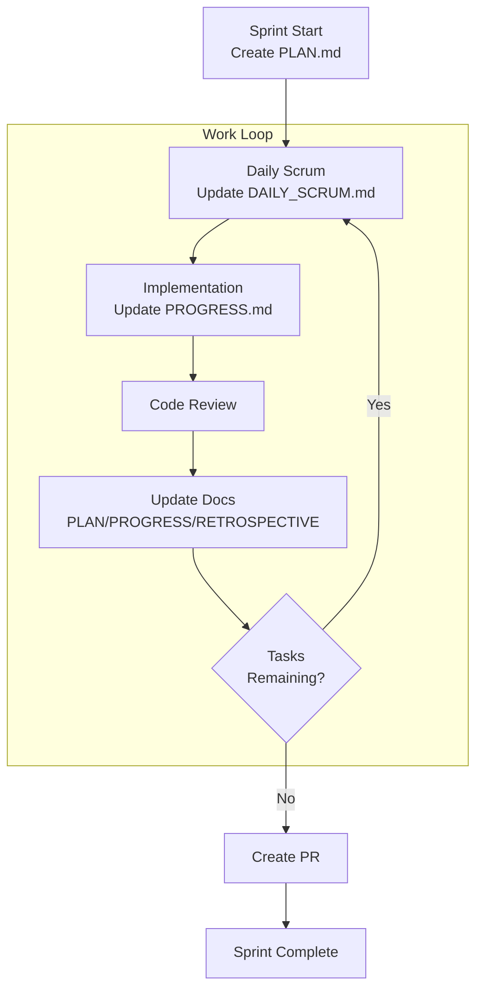

# Scrum Development Framework

An agile development methodology using fixed-length sprints, regular ceremonies, and continuous improvement.

## Sprint Configuration

### Sprint Duration
- Standard: 1-2 weeks
- Adjusted for availability:
  - Weekend development: 1 sprint = 2 days
  - Part-time: Adjust proportionally
- Consistent duration within project

### Sprint Structure
```
Sprint Start → Planning → Daily Scrums → Development → Review → Retrospective → Sprint End
```

## Sprint Documentation

### Directory Structure
```
docs/sprints/
└── sprint-{YYYYMMDD}/
    ├── PLAN.md           # Sprint planning
    ├── DAILY_SCRUM.md    # Daily standup notes
    ├── PROGRESS.md       # Progress tracking
    └── RETROSPECTIVE.md  # Sprint retrospective
```

### Sprint Initialization
1. Create sprint directory
2. Copy templates from `.cursor/scrum-template/`
3. Review previous sprint documents
4. Load and understand all Issues
5. Begin sprint planning

## Scrum Events

### Sprint Planning
**When**: Sprint start
**Duration**: 2-4 hours (adjust for sprint length)
**Output**: PLAN.md

```markdown
# Sprint Planning - {Date}

## Sprint Goal
{Clear, achievable goal for this sprint}

## Selected Items
- [ ] Issue #123: Description (Story Points: X)
- [ ] Issue #456: Description (Story Points: Y)

## Capacity
- Available hours: X
- Story points capacity: Y

## Risks
- Risk 1: Mitigation strategy
- Risk 2: Mitigation strategy
```

### Daily Scrum
**When**: Daily (or each work session)
**Duration**: 15 minutes
**Output**: Update DAILY_SCRUM.md

```markdown
# Daily Scrum - {Date}

## Yesterday
- Completed: What was finished
- Issues: Any blockers encountered

## Today
- Plan: What will be worked on
- Focus: Primary objectives

## Blockers
- Blocker 1: Action needed
- Blocker 2: Who can help
```

### Sprint Review
**When**: Sprint end
**Duration**: 1-2 hours
**Purpose**: Demo completed work

Key Activities:
- Demonstrate completed features
- Gather stakeholder feedback
- Update product backlog
- Celebrate achievements

### Sprint Retrospective
**When**: After Sprint Review
**Duration**: 1-1.5 hours
**Output**: RETROSPECTIVE.md

```markdown
# Sprint Retrospective - {Date}

## What Went Well
- Success 1
- Success 2

## What Could Be Improved
- Issue 1: Action item
- Issue 2: Action item

## Action Items
- [ ] Action 1 - Owner
- [ ] Action 2 - Owner

## Velocity
- Planned: X story points
- Completed: Y story points
- Carry-over: Z story points
```

## Development Workflow

### Sprint Execution Flow



### Progress Tracking

#### PROGRESS.md Format
```markdown
# Sprint Progress - {Sprint Date}

## Completed
- [x] Task 1 - PR #123
- [x] Task 2 - PR #456

## In Progress
- [ ] Task 3 - 60% complete
  - Subtask 3.1 ✓
  - Subtask 3.2 (in progress)
  - Subtask 3.3

## Blocked
- [ ] Task 4 - Waiting for API access

## Burndown
Day 1: 20 points remaining
Day 2: 15 points remaining
Day 3: 10 points remaining
```

## Roles and Responsibilities

### Product Owner
- Maintains product backlog
- Prioritizes Issues
- Accepts completed work
- Provides clarification

### Scrum Master
- Facilitates ceremonies
- Removes blockers
- Ensures process adherence
- Coaches team

### Development Team
- Estimates work
- Commits to sprint goals
- Self-organizes
- Delivers increments

## Scrum Artifacts

### Product Backlog
- GitHub Issues list
- Prioritized by value
- Estimated in story points
- Continuously refined

### Sprint Backlog
- Selected Issues for sprint
- Task breakdown
- Daily updates
- Visible to all

### Increment
- Working software
- Potentially shippable
- Meets Definition of Done
- Demonstrated in review

## Definition of Done

### Code Complete
- [ ] Feature implemented
- [ ] Tests written and passing
- [ ] Code reviewed
- [ ] Documentation updated

### Quality Assured
- [ ] No critical bugs
- [ ] Performance acceptable
- [ ] Security reviewed
- [ ] Accessibility checked

### Ready to Ship
- [ ] Merged to main
- [ ] Deployed to staging
- [ ] Stakeholder approved
- [ ] Release notes prepared

## Integration with Other Methodologies

### With GitHub IDD
- Issues = Product Backlog Items
- Issue Points = Story Points
- Milestones = Sprints
- Projects = Sprint Board

### With TDD
- Write tests during sprint
- Red-Green-Refactor within tasks
- Test coverage in Definition of Done
- Demo includes test results

## Metrics and Monitoring

### Sprint Metrics
- **Velocity**: Story points completed per sprint
- **Burndown**: Daily progress toward goal
- **Cycle Time**: Issue start to completion
- **Quality**: Defects found post-sprint

### Team Health
- Sprint goal achievement rate
- Retrospective action completion
- Team satisfaction scores
- Stakeholder feedback

## Common Pitfalls

### Avoid
- ❌ Changing sprint scope mid-sprint
- ❌ Skipping ceremonies
- ❌ Working without daily updates
- ❌ Ignoring retrospective actions
- ❌ Overcommitting capacity

### Embrace
- ✅ Consistent sprint length
- ✅ Regular communication
- ✅ Continuous improvement
- ✅ Sustainable pace
- ✅ Team empowerment

## Tools and Commands

### Sprint Management
```bash
# Create sprint directory
mkdir -p docs/sprints/sprint-$(date +%Y%m%d)

# Copy templates
cp -r .cursor/scrum-template/* docs/sprints/sprint-$(date +%Y%m%d)/

# List sprint Issues
gh issue list --milestone "Sprint $(date +%Y%m%d)"

# Update Issue progress
gh issue comment 123 --body "Progress: 60% complete"
```

### Quick Commands
```bash
# Start sprint
./scripts/start-sprint.sh

# Daily update
./scripts/daily-scrum.sh

# End sprint
./scripts/end-sprint.sh
```

## Critical Rules

⚠️ **NEVER** mark a task complete without verification
⚠️ **ALWAYS** update documentation during sprint
⚠️ **MAINTAIN** sustainable development pace
⚠️ **RESPECT** sprint boundaries and commitments