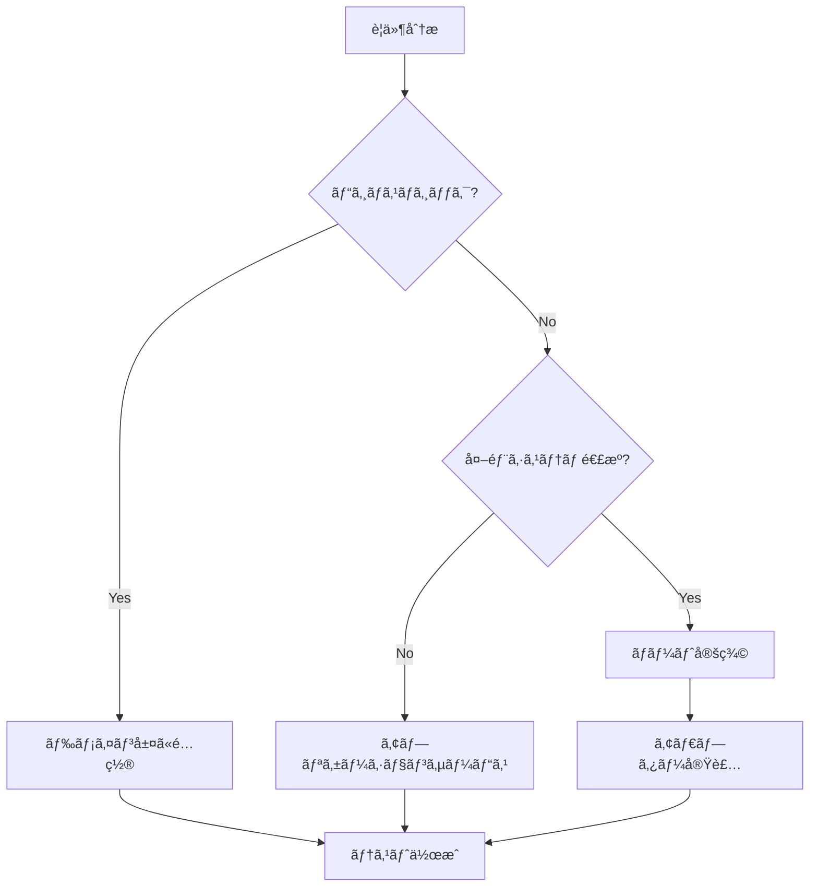
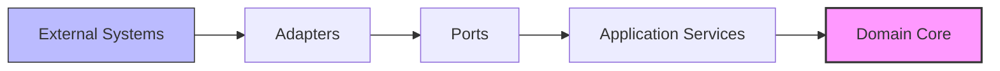

# Hexagonal Architecture (Ports and Adapters) パターン

> ğŸ—ï¸ **アーキテクãƒãƒ£**: ビジãƒã‚¹ãƒ­ã‚¸ãƒƒã‚¯ã®ç‹¬ç«‹æ€§ã¨æŠ€è¡“的柔軟性を両立
> 
> 🔧 **設計åŸå‰‡**: ãƒãƒ¼ãƒˆãƒ»ã‚¢ãƒ€ãƒ—ターパターンã«ã‚ˆã‚‹ç–çµåˆè¨­è¨ˆ
> 
> âš¡ **特徴**: テスタビリティã€æŠ€è¡“éä¾å­˜ã€ã‚¢ãƒ€ãƒ—ター交æ›å¯èƒ½æ€§

## 📚 学習パス

### 🯠基ç¤æ¦‚念ã®ç†è§£
1. **[アーキテクãƒãƒ£åŸå‰‡](./core-concepts.md)** - ヘキサゴナルã®åŸºæœ¬æ€æƒ³
2. **[ドメイン層](./domain-layer.md)** - ビジãƒã‚¹ãƒ­ã‚¸ãƒƒã‚¯ã®å®Ÿè£…

### 🔌 ãƒãƒ¼ãƒˆãƒ»ã‚¢ãƒ€ãƒ—ター設計
3. **[ãƒãƒ¼ãƒˆã‚¤ãƒ³ã‚¿ãƒ¼ãƒ•ã‚§ãƒ¼ã‚¹](./ports-interfaces.md)** - 契約定義
4. **[アプリケーションサービス](./application-services.md)** - ユースケース実装
5. **[アダプター実装](./adapters-implementation.md)** - 外部技術統åˆ

### 🚀 実装・é‹ç”¨
6. **[テスト・デプロイメント](./testing-deployment.md)** - å“質ä¿è¨¼ã¨é…布
7. **[ベストプラクティス](./best-practices.md)** - 最é©åŒ–ã¨ç›£è¦–

## 🚀 Quick Start

### ミニãƒãƒ«å®Ÿè£…例

```typescript
// 1. ドメインモデル定義
class Order {
  constructor(
    private id: OrderId,
    private items: OrderItem[],
    private status: OrderStatus
  ) {}
}

// 2. ãƒãƒ¼ãƒˆå®šç¾©
interface OrderRepository {
  save(order: Order): Promise<void>;
  findById(id: OrderId): Promise<Order>;
}

// 3. アプリケーションサービス
class CreateOrderService {
  constructor(private orderRepo: OrderRepository) {}
  
  async execute(command: CreateOrderCommand): Promise<Order> {
    const order = new Order(command.items);
    await this.orderRepo.save(order);
    return order;
  }
}

// 4. アダプター実装
class PostgresOrderRepository implements OrderRepository {
  async save(order: Order): Promise<void> {
    // PostgreSQL specific implementation
  }
}
```

### 設計判断フローãƒãƒ£ãƒ¼ãƒˆ


```mermaid
graph TD
    A[è¦ä»¶åˆ†æ] --> B{ビジãƒã‚¹ãƒ­ã‚¸ãƒƒã‚¯?}
    B -->|Yes| C[ドメイン層ã«é…ç½®]
    B -->|No| D{外部システム連�}
    D -->|Yes| E[ãƒãƒ¼ãƒˆå®šç¾©]
    D -->|No| F[アプリケーションサービス]
    E --> G[アダプター実装]
    C --> H[テスト作æˆ]
    F --> H
    G --> H
```

## ğŸ›ï¸ アーキテクãƒãƒ£æ§‹é€ 

```yaml
hexagonal_structure:
  core:
    - Domain Models (エンティティã€å€¤ã‚ªãƒ–ジェクト)
    - Domain Services (ドメインロジック)
  
  application:
    - Use Case Services (ユースケース実装)
    - Application Events (アプリケーションイベント)
  
  ports:
    primary: # 駆動å´ãƒãƒ¼ãƒˆ
      - REST API Port
      - GraphQL Port  
      - CLI Port
    secondary: # 被駆動å´ãƒãƒ¼ãƒˆ
      - Repository Port
      - External Service Port
      - Notification Port
  
  adapters:
    primary: # 駆動å´ã‚¢ãƒ€ãƒ—ター
      - HTTP Rest Adapter
      - GraphQL Adapter
      - Command Line Adapter
    secondary: # 被駆動å´ã‚¢ãƒ€ãƒ—ター
      - Database Adapter
      - Message Queue Adapter
      - External API Adapter
```

## 🔄 ä¾å­˜é–¢ä¿‚ルール


```mermaid
graph LR
    A[External Systems] --> B[Adapters]
    B --> C[Ports]
    C --> D[Application Services]
    D --> E[Domain Core]
    
    style E fill:#f9f,stroke:#333,stroke-width:2px
    style A fill:#bbf,stroke:#333,stroke-width:1px
```

**ä¾å­˜æ–¹å‘**: 外部 → アダプター → ãƒãƒ¼ãƒˆ → アプリケーション → ドメイン

## 📊 学習進æ—ãƒã‚§ãƒƒã‚¯ãƒªã‚¹ãƒˆ

### Phase 1: 基ç¤ç†è§£
- [ ] ヘキサゴナルアーキテクãƒãƒ£ã®åŸå‰‡ç†è§£
- [ ] ãƒãƒ¼ãƒˆãƒ»ã‚¢ãƒ€ãƒ—ターパターンã®æ¦‚念
- [ ] ä¾å­˜é–¢ä¿‚逆転ã®åŸå‰‡

### Phase 2: 実装技術
- [ ] ドメインモデルã®è¨­è¨ˆ
- [ ] ãƒãƒ¼ãƒˆã‚¤ãƒ³ã‚¿ãƒ¼ãƒ•ã‚§ãƒ¼ã‚¹ã®å®šç¾©
- [ ] アダプター実装パターン

### Phase 3: 実践応用
- [ ] テスト駆動開発ã¨ã®çµ„ã¿åˆã‚ã›
- [ ] CI/CDパイプライン構築
- [ ] 監視・é‹ç”¨è¨­è¨ˆ

## ğŸ› ï¸ å®Ÿè£…æ”¯æ´ãƒ„ール

```bash
# プロジェクト構造ã®ç”Ÿæˆ
mkdir -p src/{domain,application,ports,adapters}/{models,services}

# テストディレクトリ
mkdir -p tests/{unit,integration,e2e}

# 設定ファイル
touch docker-compose.yml tsconfig.json jest.config.js
```

