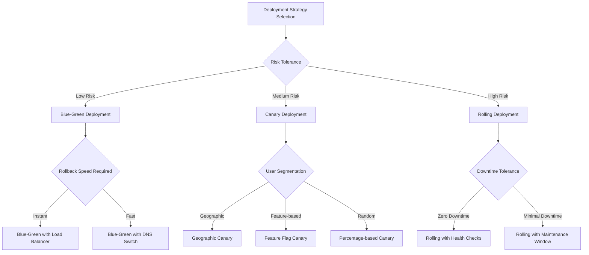

# Best Practices

## CI/CD Maturity Model

```yaml
maturity_levels:
  level_1_basic:
    description: "Automated builds and basic testing"
    characteristics:
      - Automated build on commit
      - Basic unit testing
      - Manual deployment
    prerequisites:
      - Version control system
      - Build automation
      - Basic test suite
    
  level_2_managed:
    description: "Automated deployment with quality gates"
    characteristics:
      - Automated testing pipeline
      - Deployment to staging
      - Code quality checks
      - Basic monitoring
    prerequisites:
      - CI pipeline established
      - Staging environment
      - Test automation
    
  level_3_defined:
    description: "Standardized processes across teams"
    characteristics:
      - Multi-environment deployment
      - Advanced testing strategies
      - Security scanning
      - Performance monitoring
    prerequisites:
      - Multiple environments
      - Security integration
      - Monitoring systems
    
  level_4_optimized:
    description: "Continuous improvement and optimization"
    characteristics:
      - Feature flags and canary deployments
      - Advanced monitoring and alerting
      - Automated rollback
      - Cross-team collaboration
    prerequisites:
      - Advanced deployment strategies
      - Comprehensive monitoring
      - Incident response processes
    
  level_5_innovating:
    description: "Industry-leading practices and innovation"
    characteristics:
      - Self-healing systems
      - Predictive monitoring
      - AI-assisted development
      - Chaos engineering
    prerequisites:
      - Mature DevOps culture
      - Advanced automation
      - Continuous learning mindset
```

## Pipeline Design Principles

```typescript
interface PipelineDesignPrinciples {
  failFast: {
    description: "Place fastest tests first to provide rapid feedback";
    implementation: string[];
  };
  parallelization: {
    description: "Run independent stages concurrently";
    implementation: string[];
  };
  immutableArtifacts: {
    description: "Build once, deploy many times";
    implementation: string[];
  };
}

const designPrinciples: PipelineDesignPrinciples = {
  failFast: {
    description: "Place fastest tests first to provide rapid feedback",
    implementation: [
      "Run linting before unit tests",
      "Execute smoke tests before full integration suite",
      "Perform security scans in parallel with builds",
      "Set timeout limits on all pipeline stages"
    ]
  },
  
  parallelization: {
    description: "Run independent stages concurrently",
    implementation: [
      "Run unit tests across multiple shards",
      "Execute different test suites in parallel",
      "Build and test multiple platforms simultaneously",
      "Perform security and quality scans concurrently"
    ]
  },
  
  immutableArtifacts: {
    description: "Build once, deploy many times",
    implementation: [
      "Use semantic versioning for all artifacts",
      "Store artifacts in central registry",
      "Promote same artifact across environments",
      "Include metadata and provenance information"
    ]
  }
};

// Pipeline optimization calculator
class PipelineOptimizer {
  calculateOptimalStageOrder(stages: PipelineStage[]): PipelineStage[] {
    return stages.sort((a, b) => {
      // Prioritize by speed (faster first) and criticality
      const aScore = (1 / a.avgDuration) * a.criticalityScore;
      const bScore = (1 / b.avgDuration) * b.criticalityScore;
      return bScore - aScore;
    });
  }

  identifyParallelizationOpportunities(stages: PipelineStage[]): ParallelGroup[] {
    const groups: ParallelGroup[] = [];
    const independentStages = stages.filter(stage => 
      !stage.dependencies || stage.dependencies.length === 0
    );
    
    if (independentStages.length > 1) {
      groups.push({
        name: 'parallel-independent',
        stages: independentStages,
        estimatedTimeReduction: this.calculateTimeReduction(independentStages)
      });
    }
    
    return groups;
  }
}
```

## Quality Gates Framework

```bash
#!/bin/bash
# quality-gates.sh - Comprehensive quality gate implementation

enforce_quality_gates() {
    local stage=$1
    local threshold_file="quality-thresholds.json"
    
    echo "Enforcing quality gates for stage: $stage"
    
    case $stage in
        "code_quality")
            enforce_code_quality_gates
            ;;
        "security")
            enforce_security_gates
            ;;
        "performance")
            enforce_performance_gates
            ;;
        "deployment")
            enforce_deployment_gates
            ;;
    esac
}

enforce_code_quality_gates() {
    # Test coverage gate
    local coverage=$(jq -r '.coverage.total' coverage-report.json)
    local coverage_threshold=$(jq -r '.thresholds.coverage' quality-thresholds.json)
    
    if (( $(echo "$coverage < $coverage_threshold" | bc -l) )); then
        echo "❌ Coverage gate failed: $coverage% < $coverage_threshold%"
        exit 1
    fi
    
    # Code complexity gate
    local complexity=$(jq -r '.complexity.average' complexity-report.json)
    local complexity_threshold=$(jq -r '.thresholds.complexity' quality-thresholds.json)
    
    if (( $(echo "$complexity > $complexity_threshold" | bc -l) )); then
        echo "❌ Complexity gate failed: $complexity > $complexity_threshold"
        exit 1
    fi
    
    # Technical debt ratio
    local debt_ratio=$(jq -r '.debt.ratio' sonar-report.json)
    local debt_threshold=$(jq -r '.thresholds.technicalDebt' quality-thresholds.json)
    
    if (( $(echo "$debt_ratio > $debt_threshold" | bc -l) )); then
        echo "❌ Technical debt gate failed: $debt_ratio% > $debt_threshold%"
        exit 1
    fi
    
    echo "✅ All code quality gates passed"
}

enforce_security_gates() {
    # Vulnerability count gate
    local critical_vulns=$(jq -r '.vulnerabilities.critical' security-report.json)
    local high_vulns=$(jq -r '.vulnerabilities.high' security-report.json)
    
    if [[ $critical_vulns -gt 0 ]] || [[ $high_vulns -gt 5 ]]; then
        echo "❌ Security gate failed: $critical_vulns critical, $high_vulns high vulnerabilities"
        exit 1
    fi
    
    # License compliance gate
    local license_violations=$(jq -r '.licenses.violations | length' license-report.json)
    
    if [[ $license_violations -gt 0 ]]; then
        echo "❌ License compliance gate failed: $license_violations violations"
        exit 1
    fi
    
    echo "✅ All security gates passed"
}
```

## Deployment Strategy Selection



## Monitoring and Alerting Strategy

```javascript
// comprehensive-monitoring.js
class ComprehensiveMonitoring {
  constructor() {
    this.slos = {
      availability: 99.9,        // 99.9% uptime
      latency: 500,             // 95th percentile < 500ms
      errorRate: 1,             // < 1% error rate
      deployment: 95            // 95% deployment success rate
    };
  }

  setupAlerts() {
    return {
      // Critical alerts - immediate response required
      critical: [
        {
          name: 'Service Down',
          condition: 'availability < 99%',
          channels: ['pagerduty', 'slack-critical'],
          escalation: '5 minutes'
        },
        {
          name: 'High Error Rate',
          condition: 'error_rate > 5% for 2 minutes',
          channels: ['pagerduty', 'slack-critical'],
          escalation: '2 minutes'
        }
      ],
      
      // Warning alerts - action needed within business hours
      warning: [
        {
          name: 'SLO Burn Rate',
          condition: 'slo_burn_rate > 2x for 15 minutes',
          channels: ['slack-alerts', 'email'],
          escalation: '30 minutes'
        },
        {
          name: 'Deployment Failure',
          condition: 'deployment_success_rate < 90%',
          channels: ['slack-deployment', 'email'],
          escalation: 'business hours'
        }
      ],
      
      // Info alerts - for awareness and trending
      info: [
        {
          name: 'Performance Degradation',
          condition: 'p95_latency > 300ms for 10 minutes',
          channels: ['slack-performance'],
          escalation: 'none'
        },
        {
          name: 'Capacity Planning',
          condition: 'cpu_usage > 70% for 1 hour',
          channels: ['slack-infrastructure'],
          escalation: 'none'
        }
      ]
    };
  }

  createDashboards() {
    return {
      executive: {
        name: 'Executive Overview',
        panels: [
          'Service Level Objectives',
          'Deployment Success Rate',
          'Mean Time to Recovery',
          'Business Metrics'
        ]
      },
      
      operational: {
        name: 'Operations Dashboard',
        panels: [
          'System Health',
          'Pipeline Status',
          'Error Rates',
          'Performance Metrics'
        ]
      },
      
      development: {
        name: 'Development Metrics',
        panels: [
          'Build Success Rate',
          'Test Coverage Trends',
          'Code Quality Metrics',
          'Deployment Frequency'
        ]
      }
    };
  }
}
```

## Implementation Roadmap

```yaml
implementation_roadmap:
  phase_1_foundation:
    duration: "2-4 weeks"
    objectives:
      - Establish basic CI pipeline
      - Implement automated testing
      - Set up staging environment
    deliverables:
      - Working CI pipeline
      - Test automation framework
      - Deployment to staging
    success_criteria:
      - 90% build success rate
      - All tests automated
      - Consistent staging deployments
    
  phase_2_integration:
    duration: "3-6 weeks"
    objectives:
      - Add security scanning
      - Implement quality gates
      - Set up monitoring
    deliverables:
      - Security pipeline integration
      - Quality gate enforcement
      - Basic monitoring dashboards
    success_criteria:
      - Zero critical vulnerabilities
      - Quality gates prevent bad deploys
      - Monitoring covers key metrics
    
  phase_3_optimization:
    duration: "4-8 weeks"
    objectives:
      - Optimize pipeline performance
      - Advanced deployment strategies
      - Comprehensive monitoring
    deliverables:
      - Optimized build times
      - Blue-green deployments
      - Advanced alerting
    success_criteria:
      - Build time < 10 minutes
      - Zero-downtime deployments
      - Proactive issue detection
    
  phase_4_maturation:
    duration: "6-12 weeks"
    objectives:
      - Cross-team standardization
      - Advanced features
      - Culture transformation
    deliverables:
      - Standardized processes
      - Feature flags and canary
      - DevOps culture adoption
    success_criteria:
      - Consistent practices across teams
      - Advanced deployment capabilities
      - High team satisfaction
```

## Success Metrics and KPIs

```typescript
interface DevOpsMetrics {
  // DORA Metrics (DevOps Research & Assessment)
  deploymentFrequency: number;    // Deployments per week
  leadTime: number;               // Commit to production (hours)
  changeFailureRate: number;      // Percentage of failed deployments
  meanTimeToRecovery: number;     // Hours to recover from failure
  
  // Additional Quality Metrics
  testCoverage: number;           // Percentage
  buildSuccessRate: number;       // Percentage
  pipelineEfficiency: number;     // Successful pipelines per total
  
  // Business Impact Metrics
  customerSatisfaction: number;   // CSAT score
  timeToMarket: number;          // Features delivered per sprint
  systemReliability: number;     // Uptime percentage
}

const benchmarks = {
  elite: {
    deploymentFrequency: 100,      // Multiple per day
    leadTime: 1,                   // Less than 1 hour
    changeFailureRate: 5,          // 0-15%
    meanTimeToRecovery: 1          // Less than 1 hour
  },
  high: {
    deploymentFrequency: 7,        // Weekly
    leadTime: 24,                  // Less than 1 day
    changeFailureRate: 10,         // 0-15%
    meanTimeToRecovery: 24         // Less than 1 day
  },
  medium: {
    deploymentFrequency: 1,        // Monthly
    leadTime: 168,                 // 1 week to 1 month
    changeFailureRate: 15,         // 0-15%
    meanTimeToRecovery: 168        // 1 day to 1 week
  }
};
```

## Cultural Transformation

1. **Collaboration**: Break down silos between development and operations teams
2. **Continuous Learning**: Encourage experimentation and learning from failures
3. **Automation**: Automate repetitive tasks to focus on value-added activities
4. **Measurement**: Make decisions based on data and metrics
5. **Feedback**: Create fast feedback loops at all levels
6. **Shared Responsibility**: Everyone owns quality, security, and reliability
7. **Continuous Improvement**: Regularly retrospect and improve processes