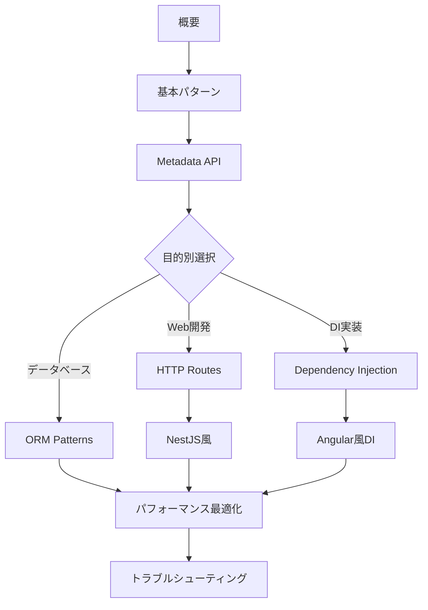

# TypeScript Decorators & Metadata Patterns

> 🎯 **目的**: TypeScriptのDecoratorsとメタデータAPIを活用したメタプログラミングパターンの包括的ガイド
> 
> 📊 **対象**: Stage 3 Decorator Proposal準拠、TypeScript 5.0+対応
> 
> ⚡ **特徴**: 実行可能なコード例、実世界での応用パターン、パフォーマンス考慮

このドキュメントは複数のモジュールに分割されています。各モジュールは独立して参照可能で、必要な部分だけを選択的に学習できます。

## 📚 モジュール一覧

### 基礎編

1. **[概要と2024年の現状](./overview.md)**
   - TC39 Decorator Proposal (Stage 3)の現状
   - TypeScript設定
   - Decoratorの種類と基本構文
   - Legacy DecoratorとStage 3の違い

2. **[基本的なDecoratorパターン](./basic-patterns.md)**
   - Decorator Factory Pattern
   - Method Decorator Composition
   - Property Decorator Patterns
   - Class Decorator Patterns

3. **[Metadata APIと反射的プログラミング](./metadata-api.md)**
   - reflect-metadata基礎
   - 型メタデータの活用
   - カスタムメタデータシステム

### 応用編

4. **[Dependency Injection Container](./dependency-injection.md)**
   - DI Container実装
   - サービス定義と実装
   - 高度なDIパターン

5. **[ORM-style Entity Decorators](./orm-patterns.md)**
   - Entity メタデータシステム
   - ORM Decorators
   - Repository パターン
   - Entity定義と使用例

6. **[HTTP Route Decorators](./http-routes.md)**
   - メタデータストレージ
   - HTTP Method Decorators
   - Parameter Decorators
   - Router実装

### フレームワーク実装

7. **[Angular風Dependency Injection](./angular-style-di.md)**
   - InjectionTokenとプロバイダーシステム
   - Injector実装
   - Angular風デコレーター
   - コンポーネントとモジュール

8. **[NestJS風のHTTP Framework](./nestjs-style.md)**
   - Guards、Interceptors、Pipes
   - Exception クラス
   - フレームワークデコレーター
   - アプリケーションブートストラップ

### 最適化と実践

9. **[パフォーマンス最適化](./performance-optimization.md)**
   - Decorator実行時パフォーマンス
   - Memory-Efficient Decorators
   - 最適化されたMetadata使用パターン
   - Production Ready設定
   - Tree-shaking対応パターン

10. **[トラブルシューティングとマイグレーション](./troubleshooting.md)**
    - 一般的な問題と解決策
    - Legacy Decoratorからの移行
    - デバッグとテスト戦略
    - エラー処理パターン

11. **[参考資料とさらなる学習](./references.md)**
    - 公式仕様とドキュメント
    - 実装例が学べるプロジェクト
    - ベストプラクティス
    - 今後の展望

## 🎯 使い方

### 初学者の方へ

1. まず[概要と2024年の現状](./overview.md)でDecoratorsの基本を理解
2. [基本的なDecoratorパターン](./basic-patterns.md)で実装パターンを学習
3. [Metadata API](./metadata-api.md)でメタプログラミングの基礎を習得

### 実践的な実装を求める方へ

- DIシステム構築: [Dependency Injection](./dependency-injection.md)
- ORMの実装: [ORM Patterns](./orm-patterns.md)
- Web API構築: [HTTP Routes](./http-routes.md)

### フレームワーク開発者の方へ

- [Angular風DI](./angular-style-di.md)でエンタープライズ級のDI実装
- [NestJS風Framework](./nestjs-style.md)でフルスタックフレームワーク構築

### 本番環境への導入を検討中の方へ

- [パフォーマンス最適化](./performance-optimization.md)で実行時の影響を理解
- [トラブルシューティング](./troubleshooting.md)で問題解決手法を習得

## 💡 推奨学習パス



## 🚀 Quick Start

```bash
# 必要な依存関係のインストール
npm install reflect-metadata
npm install -D @types/reflect-metadata typescript@5.0+

# tsconfig.json の設定
{
  "compilerOptions": {
    "experimentalDecorators": true,
    "emitDecoratorMetadata": true,
    "target": "ES2022",
    "useDefineForClassFields": false
  }
}
```

```typescript
// main.ts - 最初のDecorator実装
import 'reflect-metadata';

function Log(target: any, propertyKey: string, descriptor: PropertyDescriptor) {
  const originalMethod = descriptor.value;
  
  descriptor.value = function(...args: any[]) {
    console.log(`Calling ${propertyKey} with`, args);
    const result = originalMethod.apply(this, args);
    console.log(`Result:`, result);
    return result;
  };
}

class Calculator {
  @Log
  add(a: number, b: number): number {
    return a + b;
  }
}

const calc = new Calculator();
calc.add(2, 3); // ログ出力とともに5を返す
```

## 📖 関連リソース

- [TC39 Decorator Proposal](https://github.com/tc39/proposal-decorators)
- [TypeScript Handbook - Decorators](https://www.typescriptlang.org/docs/handbook/decorators.html)
- [reflect-metadata](https://www.npmjs.com/package/reflect-metadata)

---

