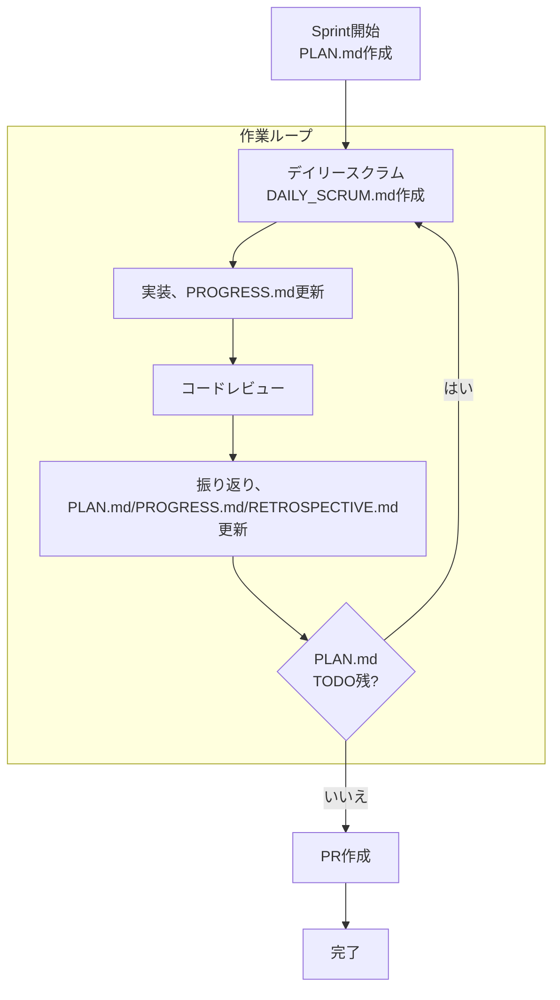

# スクラム開発
- 1スプリント1週間だが、週末しかできないため1スプリント=2日
- スクラムのドキュメントは、.cursor/scrum-template にあるテンプレートを使用する
- 1スプリントのスクラムに関するドキュメントは、 docs/sprints/sprint-{YYYYMMDD}/ に作成する
  - 新規Sprint開始時:
    - ディレクトリがないため、作成する
    - 以前のスプリントのドキュメントをすべて読み込み理解する
    - Issue をすべて読み込み理解する
- スクラムイベントを、ユーザーが「やろう」と提案した際は、ユーザーと一緒にスクラムイベントを行う
- 以下のフローに完全に従い、開発を行うこと
※ 完了していないタスクにチェックを入れるのは重罪

