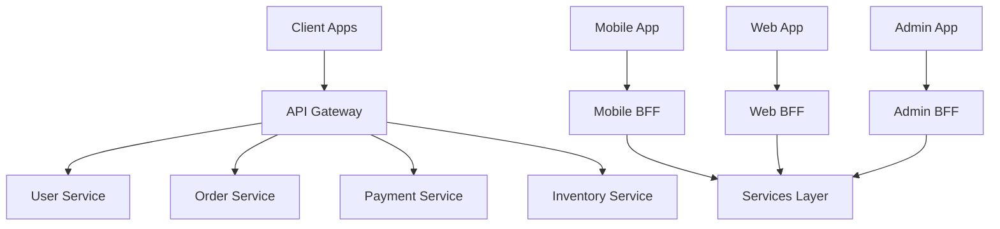

# Core Concepts & API Gateway Architecture

> 🎯 **目的**: API Gatewayの基本概念とアーキテクチャの理解
> 
> 📊 **対象**: マイクロサービス環境でのAPI Gateway実装の基礎
> 
> ⚡ **特徴**: パターン分析、実装戦略、設計原則

## Core Concepts

### API Gateway Architecture
```yaml
api_gateway_fundamentals:
  definition: "Single entry point for all client requests"
  
  core_responsibilities:
    - Request Routing
    - Protocol Translation
    - Authentication & Authorization
    - Rate Limiting
    - Request/Response Transformation
    - Circuit Breaking
    - Monitoring & Analytics
    
  benefits:
    - Simplified client interface
    - Centralized cross-cutting concerns
    - Service decoupling
    - Enhanced security
    - Better observability
    
  patterns:
    - Backend for Frontend (BFF)
    - API Composition
    - Request Aggregation
    - Service Mesh Integration
```

## アーキテクチャパターン

### 1. 単一Gateway vs 複数Gateway



### 2. レイヤー化アーキテクチャ

```yaml
gateway_layers:
  presentation_layer:
    - Protocol handling (HTTP/WebSocket/gRPC)
    - Request validation
    - Response formatting
    
  security_layer:
    - Authentication
    - Authorization
    - SSL/TLS termination
    - API key validation
    
  routing_layer:
    - Service discovery
    - Load balancing
    - Request routing
    - Health checking
    
  transformation_layer:
    - Request/Response transformation
    - Protocol translation
    - Data aggregation
    - Response composition
    
  monitoring_layer:
    - Logging
    - Metrics collection
    - Distributed tracing
    - Error handling
```

### 3. 主要コンポーネント

```typescript
// Gateway Core Interfaces
export interface GatewayConfig {
  port: number;
  services: ServiceConfig[];
  middleware: MiddlewareConfig;
  security: SecurityConfig;
  monitoring: MonitoringConfig;
}

export interface ServiceConfig {
  name: string;
  path: string;
  target: string;
  methods: string[];
  timeout?: number;
  retries?: number;
  circuitBreaker?: CircuitBreakerConfig;
  rateLimit?: RateLimitConfig;
  cache?: CacheConfig;
  transform?: TransformConfig;
  auth?: AuthConfig;
}

export interface MiddlewareConfig {
  rateLimit: RateLimitConfig;
  cache: CacheConfig;
  cors: CorsConfig;
  compression: CompressionConfig;
}

export interface SecurityConfig {
  jwt: JwtConfig;
  apiKeys: ApiKeyConfig;
  oauth: OAuthConfig;
  cors: CorsConfig;
}

export interface MonitoringConfig {
  metrics: MetricsConfig;
  logging: LoggingConfig;
  tracing: TracingConfig;
  health: HealthConfig;
}
```

## 実装戦略

### 1. 段階的導入アプローチ

```yaml
migration_phases:
  phase_1_basic_proxy:
    - Simple request forwarding
    - Basic health checks
    - Request logging
    
  phase_2_security:
    - Authentication integration
    - Authorization policies
    - Rate limiting
    
  phase_3_reliability:
    - Circuit breakers
    - Retry mechanisms
    - Timeout handling
    
  phase_4_advanced:
    - Request transformation
    - Response aggregation
    - Caching strategies
    
  phase_5_observability:
    - Distributed tracing
    - Advanced metrics
    - Custom dashboards
```

### 2. スケーラビリティ考慮

```typescript
// Horizontal Scaling Configuration
export interface ScalingConfig {
  instances: {
    min: number;
    max: number;
    target_cpu: number;
    target_memory: number;
  };
  
  load_balancer: {
    algorithm: 'round_robin' | 'least_connections' | 'ip_hash';
    health_check: {
      interval: number;
      timeout: number;
      retries: number;
      path: string;
    };
  };
  
  clustering: {
    enabled: boolean;
    sticky_sessions: boolean;
    session_store: 'redis' | 'memcached' | 'database';
  };
}

// Service Mesh Integration
export interface ServiceMeshConfig {
  sidecar_injection: boolean;
  mtls_enabled: boolean;
  traffic_policy: {
    timeout: string;
    retries: number;
    circuit_breaker: {
      max_connections: number;
      max_requests: number;
      max_retries: number;
    };
  };
}
```

### 3. パフォーマンス最適化

```yaml
performance_strategies:
  connection_pooling:
    - HTTP/2 support
    - Keep-alive connections
    - Connection limits per service
    
  caching_layers:
    - Response caching
    - Request deduplication
    - CDN integration
    
  request_optimization:
    - Request batching
    - Parallel processing
    - Async processing for non-critical operations
    
  compression:
    - Gzip/Brotli compression
    - Payload size limits
    - Streaming responses
```

## 設計原則

### 1. Single Responsibility Principle

```typescript
// 機能ごとに分離されたミドルウェア
export class GatewayMiddleware {
  // 認証専用
  static authentication(): RequestHandler {
    return (req, res, next) => {
      // Authentication logic only
    };
  }
  
  // レート制限専用
  static rateLimit(config: RateLimitConfig): RequestHandler {
    return (req, res, next) => {
      // Rate limiting logic only
    };
  }
  
  // メトリクス収集専用
  static metrics(): RequestHandler {
    return (req, res, next) => {
      // Metrics collection logic only
    };
  }
}
```

### 2. Configuration as Code

```yaml
# gateway-config.yaml
apiVersion: v1
kind: ConfigMap
metadata:
  name: gateway-config
data:
  config.yaml: |
    gateway:
      port: 8080
      middleware:
        rate_limit:
          window_size: 60
          max_requests: 1000
        cache:
          ttl: 300
          max_size: "100MB"
      
      services:
        - name: user-service
          path: /api/users
          target: http://user-service:8080
          methods: [GET, POST, PUT, DELETE]
          timeout: 5000
          circuit_breaker:
            failure_threshold: 5
            timeout: 10000
            recovery_timeout: 30000
          
        - name: order-service
          path: /api/orders
          target: http://order-service:8080
          methods: [GET, POST]
          rate_limit:
            max_requests: 100
            window_size: 60
```

### 3. Observability First

```typescript
// 包括的なログ記録とメトリクス
export class ObservabilityManager {
  private logger: Logger;
  private metrics: MetricsCollector;
  private tracer: Tracer;
  
  constructor() {
    this.logger = new Logger({
      level: process.env.LOG_LEVEL || 'info',
      format: 'json',
      correlationId: true
    });
    
    this.metrics = new MetricsCollector({
      prometheus: true,
      custom_metrics: true
    });
    
    this.tracer = new Tracer({
      service_name: 'api-gateway',
      jaeger_endpoint: process.env.JAEGER_ENDPOINT
    });
  }
  
  middleware(): RequestHandler {
    return (req, res, next) => {
      const span = this.tracer.startSpan(`${req.method} ${req.path}`);
      const startTime = Date.now();
      
      req.span = span;
      req.correlationId = req.headers['x-correlation-id'] || this.generateId();
      
      this.logger.info('Request received', {
        method: req.method,
        path: req.path,
        correlationId: req.correlationId,
        userAgent: req.headers['user-agent']
      });
      
      res.on('finish', () => {
        const duration = Date.now() - startTime;
        
        this.metrics.recordRequest(req.method, req.path, res.statusCode, duration);
        
        this.logger.info('Request completed', {
          method: req.method,
          path: req.path,
          statusCode: res.statusCode,
          duration,
          correlationId: req.correlationId
        });
        
        span.setTag('http.status_code', res.statusCode);
        span.setTag('http.duration', duration);
        span.finish();
      });
      
      next();
    };
  }
  
  private generateId(): string {
    return `${Date.now()}-${Math.random().toString(36).substr(2, 9)}`;
  }
}
```

## アンチパターンの回避

### 1. モノリシックGateway

```typescript
// ❌ すべてを一つのGatewayで処理
class MonolithicGateway {
  handleEverything(req: Request, res: Response) {
    // Authentication
    // Rate limiting  
    // Transformation
    // Routing
    // Caching
    // Monitoring
    // Business logic (アンチパターン!)
  }
}

// ✅ 責任を分離
class ModularGateway {
  constructor(
    private auth: AuthenticationService,
    private rateLimit: RateLimitService,
    private router: RoutingService,
    private cache: CacheService,
    private monitor: MonitoringService
  ) {}
  
  setupMiddleware() {
    return [
      this.auth.middleware(),
      this.rateLimit.middleware(),
      this.cache.middleware(),
      this.monitor.middleware(),
      this.router.middleware()
    ];
  }
}
```

### 2. 単一障害点の回避

```yaml
high_availability_design:
  multiple_instances:
    - Load balancer in front
    - Health checks enabled
    - Auto-scaling configured
    
  graceful_degradation:
    - Circuit breakers for services
    - Fallback responses
    - Cached responses when services down
    
  disaster_recovery:
    - Multi-region deployment
    - Database replication
    - Configuration backup
```