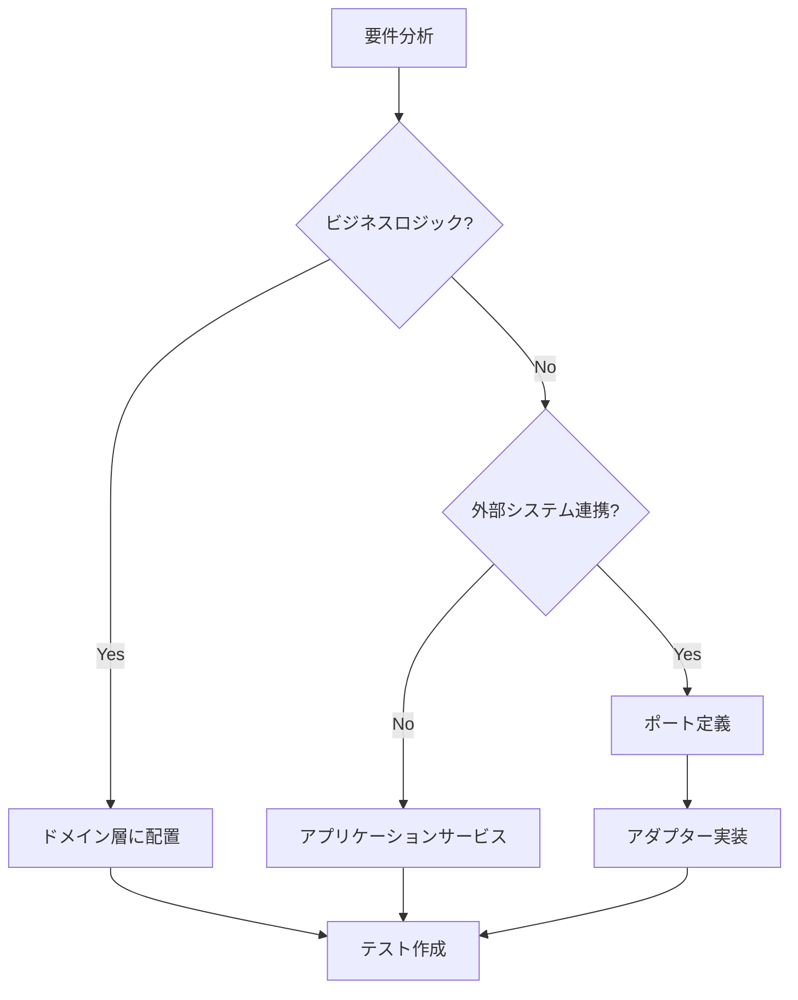
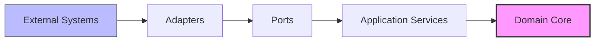

# Hexagonal Architecture (Ports and Adapters) パターン

> 🏗️ **アーキテクチャ**: ビジネスロジックの独立性と技術的柔軟性を両立
> 
> 🔧 **設計原則**: ポート・アダプターパターンによる疎結合設計
> 
> ⚡ **特徴**: テスタビリティ、技術非依存、アダプター交換可能性

## 📚 学習パス

### 🎯 基礎概念の理解
1. **[アーキテクチャ原則](./core-concepts.md)** - ヘキサゴナルの基本思想
2. **[ドメイン層](./domain-layer.md)** - ビジネスロジックの実装

### 🔌 ポート・アダプター設計
3. **[ポートインターフェース](./ports-interfaces.md)** - 契約定義
4. **[アプリケーションサービス](./application-services.md)** - ユースケース実装
5. **[アダプター実装](./adapters-implementation.md)** - 外部技術統合

### 🚀 実装・運用
6. **[テスト・デプロイメント](./testing-deployment.md)** - 品質保証と配布
7. **[ベストプラクティス](./best-practices.md)** - 最適化と監視

## 🚀 Quick Start

### ミニマル実装例

```typescript
// 1. ドメインモデル定義
class Order {
  constructor(
    private id: OrderId,
    private items: OrderItem[],
    private status: OrderStatus
  ) {}
}

// 2. ポート定義
interface OrderRepository {
  save(order: Order): Promise<void>;
  findById(id: OrderId): Promise<Order>;
}

// 3. アプリケーションサービス
class CreateOrderService {
  constructor(private orderRepo: OrderRepository) {}
  
  async execute(command: CreateOrderCommand): Promise<Order> {
    const order = new Order(command.items);
    await this.orderRepo.save(order);
    return order;
  }
}

// 4. アダプター実装
class PostgresOrderRepository implements OrderRepository {
  async save(order: Order): Promise<void> {
    // PostgreSQL specific implementation
  }
}
```

### 設計判断フローチャート



## 🏛️ アーキテクチャ構造

```yaml
hexagonal_structure:
  core:
    - Domain Models (エンティティ、値オブジェクト)
    - Domain Services (ドメインロジック)
  
  application:
    - Use Case Services (ユースケース実装)
    - Application Events (アプリケーションイベント)
  
  ports:
    primary: # 駆動側ポート
      - REST API Port
      - GraphQL Port  
      - CLI Port
    secondary: # 被駆動側ポート
      - Repository Port
      - External Service Port
      - Notification Port
  
  adapters:
    primary: # 駆動側アダプター
      - HTTP Rest Adapter
      - GraphQL Adapter
      - Command Line Adapter
    secondary: # 被駆動側アダプター
      - Database Adapter
      - Message Queue Adapter
      - External API Adapter
```

## 🔄 依存関係ルール



**依存方向**: 外部 → アダプター → ポート → アプリケーション → ドメイン

## 📊 学習進捗チェックリスト

### Phase 1: 基礎理解
- [ ] ヘキサゴナルアーキテクチャの原則理解
- [ ] ポート・アダプターパターンの概念
- [ ] 依存関係逆転の原則

### Phase 2: 実装技術
- [ ] ドメインモデルの設計
- [ ] ポートインターフェースの定義
- [ ] アダプター実装パターン

### Phase 3: 実践応用
- [ ] テスト駆動開発との組み合わせ
- [ ] CI/CDパイプライン構築
- [ ] 監視・運用設計

## 🛠️ 実装支援ツール

```bash
# プロジェクト構造の生成
mkdir -p src/{domain,application,ports,adapters}/{models,services}

# テストディレクトリ
mkdir -p tests/{unit,integration,e2e}

# 設定ファイル
touch docker-compose.yml tsconfig.json jest.config.js
```

