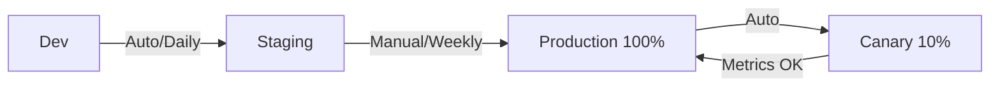

# Multi-Environment Management

## 環境戦略

### 環境階層
1. **Development**: 開発・実験用（低リソース、デバッグ有効）
2. **Staging**: 本番同等環境（中リソース、本番データ模倣）
3. **Production**: 本番環境（高リソース、完全監視）
4. **Hotfix**: 緊急修正用（本番クローン）

### 構成マトリクス
| 環境 | CPU/Mem | Replicas | Auto-scale | TLS | Rate Limit |
|------|---------|----------|------------|-----|------------|
| Dev | 0.5/512Mi | 1 | 1-3 | × | × |
| Staging | 1/1Gi | 2 | 2-5 | ✓ | ✓ |
| Prod | 2/2Gi | 3 | 3-20 | ✓ | ✓ |

## GitOpsワークフロー

```yaml
# .github/workflows/deploy.yml
name: Multi-Environment Deploy
on:
  push:
    branches: [main, staging, develop]

jobs:
  deploy:
    runs-on: ubuntu-latest
    steps:
      - name: Set Environment
        run: |
          if [[ "${{ github.ref }}" == "refs/heads/main" ]]; then
            echo "ENVIRONMENT=production" >> $GITHUB_ENV
          elif [[ "${{ github.ref }}" == "refs/heads/staging" ]]; then
            echo "ENVIRONMENT=staging" >> $GITHUB_ENV
          else
            echo "ENVIRONMENT=development" >> $GITHUB_ENV
          fi
      
      - name: Deploy to ${{ env.ENVIRONMENT }}
        uses: ./.github/actions/deploy
        with:
          environment: ${{ env.ENVIRONMENT }}
          config: ./configs/${{ env.ENVIRONMENT }}.yaml
```

## プロモーション戦略

### 自動プロモーション


### ゲート条件
- **Dev → Staging**: テスト合格率 > 95%
- **Staging → Prod**: 手動承認 + 営業時間内 + エラー率 < 0.1%
- **Canary → Full**: エラー率変化 < 5% + レイテンシ変化 < 10%

## Kubernetes環境分離

```yaml
# namespace-isolation.yaml
apiVersion: v1
kind: Namespace
metadata:
  name: production
  labels:
    env: production
    istio-injection: enabled
---
apiVersion: networking.k8s.io/v1
kind: NetworkPolicy
metadata:
  name: production-isolation
spec:
  podSelector: {}
  policyTypes: [Ingress, Egress]
  ingress:
    - from:
      - namespaceSelector:
          matchLabels:
            env: production
```

## Secret管理

### 環境別Secret
```bash
# Vault統合
vault kv put secret/dev/app db_pass=dev123
vault kv put secret/staging/app db_pass=stage456
vault kv put secret/prod/app db_pass=prod789

# K8s External Secrets
kubectl apply -f - <<EOF
apiVersion: external-secrets.io/v1beta1
kind: SecretStore
metadata:
  name: vault-backend
spec:
  provider:
    vault:
      server: "https://vault.example.com"
      path: "secret"
      auth:
        kubernetes:
          mountPath: "kubernetes"
          role: "app"
EOF
```

## 環境別機能フラグ

### LaunchDarkly統合
```typescript
const ldClient = LaunchDarkly.init(process.env.LD_SDK_KEY, {
  environment: process.env.ENVIRONMENT
});

// 環境別フラグ評価
const showNewFeature = await ldClient.variation(
  'new-feature-flag',
  user,
  false // デフォルト値
);
```

### 段階的ロールアウト
- Dev: 100%有効
- Staging: 50%有効（A/Bテスト）
- Prod: 10% → 25% → 50% → 100%

## 監視設定

### 環境別アラート閾値
| メトリクス | Dev | Staging | Prod |
|-----------|-----|---------|------|
| エラー率 | 5% | 1% | 0.1% |
| レイテンシ | 2s | 500ms | 100ms |
| CPU使用率 | 90% | 80% | 70% |

### Datadog環境タグ
```yaml
datadog:
  tags:
    - env:${ENVIRONMENT}
    - version:${VERSION}
    - service:api
  apm:
    enabled: true
    service_mapping:
      "db": "postgresql-${ENVIRONMENT}"
```

## データ管理

### 環境間データ同期
```bash
# 本番データをマスキングしてステージングへ
pg_dump prod_db | \
  sed 's/user@example.com/test@example.com/g' | \
  psql staging_db

# テストデータ生成
npm run seed:${ENVIRONMENT}
```

### マイグレーション戦略
1. Dev: 自動マイグレーション（全て許可）
2. Staging: 自動マイグレーション（破壊的変更は警告）
3. Prod: Blue-Green + 手動確認

## トラブルシューティング

### よくある問題
| 問題 | 原因 | 解決策 |
|------|------|--------|
| 環境間の動作差異 | 構成ドリフト | IaC徹底、定期同期 |
| Staging障害が本番影響 | リソース共有 | 完全分離、別クラスタ |
| Secret漏洩 | ハードコード | Vault/KMS必須 |
| データ不整合 | 同期ミス | CDC、イベントソーシング |

## ベストプラクティス

✅ **推奨**:
- 環境は完全にコード化（IaC）
- 本番同等のステージング環境
- 環境別のCI/CDパイプライン
- ゼロトラストセキュリティ
- プログレッシブデリバリー

❌ **避けるべき**:
- 手動での環境構成変更
- 本番データの下位環境使用
- 環境間でのSecret共有
- テストなしの本番デプロイ
- 環境固有のコードロジック