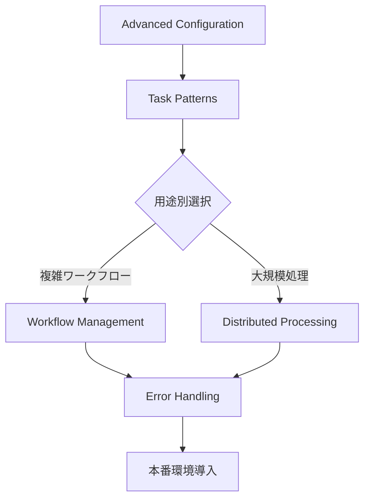

# Celery Distributed Task Patterns

> 🎯 **目的**: 本番環境で使用されるCeleryの高度な分散タスク処理パターン集
> 
> 📊 **対象**: スケーラブルな非同期処理、ワークフロー管理、監視まで包括的に対応
> 
> ⚡ **特徴**: 企業レベルの実装、実用的なコード例、本番環境での運用考慮

このドキュメントは複数のモジュールに分割されています。各モジュールは独立して参照可能で、必要な部分だけを選択的に学習できます。

## 📚 モジュール一覧

### 基礎設定編

1. **[Advanced Celery Configuration](./advanced-configuration.md)**
   - 企業レベルCelery設定
   - 動的ワーカー管理
   - セキュリティ設定と監視

### 実装パターン編

2. **[Task Patterns & Best Practices](./task-patterns.md)**
   - 高度なタスクパターン
   - カスタムタスククラス
   - 進捗追跡とデバッグ

3. **[Workflow Management](./workflow-management.md)**
   - ワークフロー管理
   - Chain、Group、Chord、Map-Reduce
   - 複雑なタスク依存関係

### 分散処理編

4. **[Distributed Processing](./distributed-processing.md)**
   - 大規模データセット処理
   - 分散Map-Reduce実装
   - 負荷分散と性能最適化

### 信頼性確保編

5. **[Error Handling & Retry Strategies](./error-handling.md)**
   - 包括的エラーハンドリング
   - リトライポリシー
   - サーキットブレーカー実装

## 🎯 使い方

### 初学者の方へ

1. まず[Advanced Configuration](./advanced-configuration.md)でCeleryの企業レベル設定を理解
2. [Task Patterns](./task-patterns.md)で基本的なタスク実装パターンを学習
3. [Workflow Management](./workflow-management.md)で複雑なワークフローの構築方法を習得

### 実践的な実装を求める方へ

- 分散処理システム構築: [Distributed Processing](./distributed-processing.md)
- 信頼性の高いシステム: [Error Handling](./error-handling.md)

### システム管理者・運用担当者の方へ

- [Advanced Configuration](./advanced-configuration.md)で動的スケーリングとモニタリング
- [Error Handling](./error-handling.md)で障害対応とアラート設定

## 💡 推奨学習パス



## 🚀 Quick Start

```bash
# 必要な依存関係のインストール
pip install celery[redis] flower kombu psycopg2-binary requests

# Redisサーバーの起動（Docker使用例）
docker run -d -p 6379:6379 redis:alpine

# 基本設定ファイルの作成
# celeryconfig.py
broker_url = 'redis://localhost:6379/0'
result_backend = 'redis://localhost:6379/0'
```

```python
# tasks.py - 最初のCeleryタスク実装
from celery import Celery

app = Celery('tasks', broker='redis://localhost:6379/0')

@app.task
def add(x, y):
    return x + y

# ワーカー起動: celery -A tasks worker --loglevel=info
# タスク実行: python -c "from tasks import add; result = add.delay(4, 4); print(result.get())"
```

## 📖 関連リソース

- [Celery Documentation](https://docs.celeryproject.org/)
- [Redis Documentation](https://redis.io/documentation)
- [RabbitMQ Documentation](https://www.rabbitmq.com/documentation.html)
- [Flower Monitoring](https://flower.readthedocs.io/)

---

